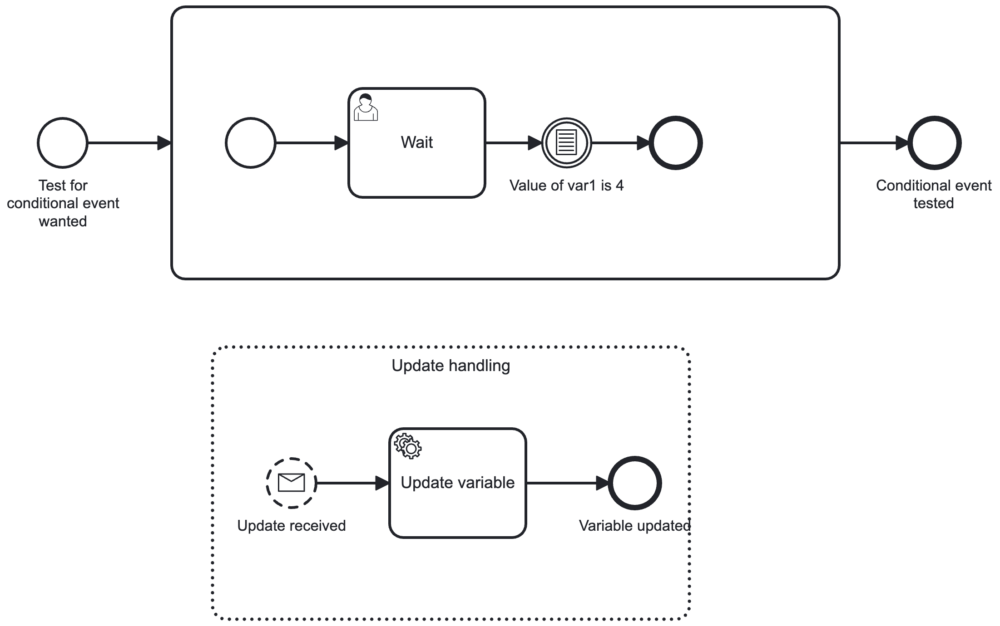

# Conditional Event Handling and Parallel Processing 

This small project enforces to run a process with a conditional event, fulfilling the condition on the same time as the process instance arrives at the conditional event.

It is know, that the process instance can stop as the condition is not re-evaluated, when the variable change happens in a overlapping transaction: https://github.com/camunda/camunda-bpm-platform/issues/2593

## The example process

## Minimizing unevaluated conditions 

You can use a feature of the Job Executor to minimize chance of parallel, overlapping transactions: exclusive job execution. This Feature guarantees, that only a single job for a process instance is executed at a time. Two jobs will be executed one after the other and committed one by one. 

You add a asynchronous before in front of the conditional event and in front of the service task, that sets the variable.

## Run the example

The example requires a local PostgresQL database. It can run in a docker container. The database url is set to `jdbc:postgresql:camunda`.

The example contains an integration test in [`ConditionalEventHandlingTest.java`](src/test/java/com/camunda/consulting/conditional_event_debugging/ConditionalEventHandlingTest.java). This test runs in the PostgresQL database with job executor enabled to have the parallel, overlapping transactions.
 